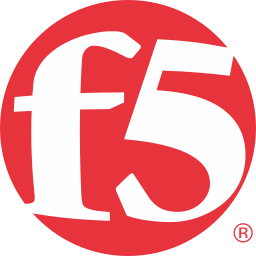

# &nbsp;&nbsp;F5 Networks

This project is dedicated to developing and sharing useful code for various F5 products and solutions.
&nbsp;&nbsp;

&nbsp;&nbsp;

## [/iapps](/iapps)
**iApps** is a system framework for deploying services-based, template-driven configurations.
&nbsp;&nbsp;

&nbsp;&nbsp;

## [/irules](/irules)
**iRules** is a highly customized scripting language allowing complete programmatic access to application traffic in real time.
&nbsp;&nbsp;

&nbsp;&nbsp;

## [/scripts](/scripts)
Scripts for various tasks.
