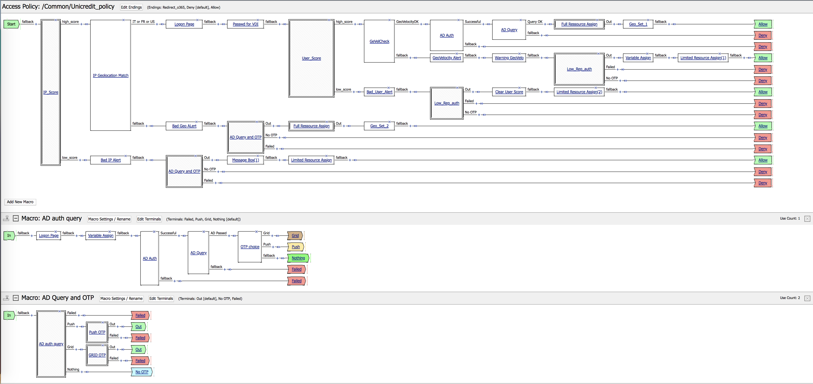
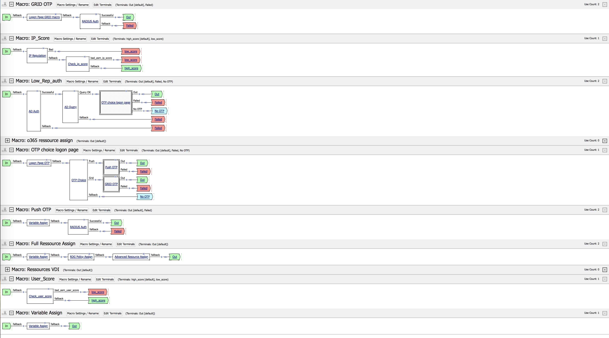

# F5 Networks

This irule uses APM + ASM. It is called Geo-Velocity and User-Scoring. It allows to control where the user connects from and if this user is changing location to fast.
Then the irule controls via ASM how many violation this user did.

Over the threshold, the user will be prompted for an OTP via a Per-Request Policy.

