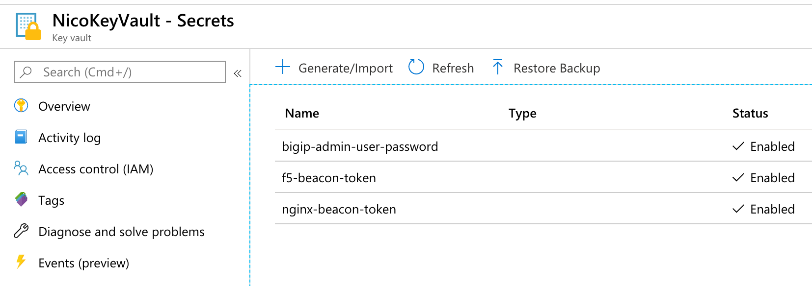

Terraform AS3 deployment
========================

AS3_Declaration is a terraform template to do AS3 based app services deployment

HowTo
-----

To be able to use this terraform template, you'll need to create the relevant *terraform.tfvars* file. You can use *terraform-example.tfvars* as your starting point (rename/copy it into *terraform.tfvars*)

Here is how to populate *terraform.tfvars*:

* f5_public_ip : Public IP of your F5 BIG-IP
* f5_admin_user : Username to use to send the AS3 API Call

We don't want to expose sensitive data so we advise to store your F5 Username password into a secure vault. In this template we leverage Azure vault/Secret.

* azure_secret_rg : Name of the ressource group containing your keyvault / secret
* azure_keyvault_name : Name of the keyvault

your KeyVault **MUST** contain a secret called: *bigip-admin-user-password*. This is the secret that Terraform will retrieve to use as the F5 username password

* as3_filename : file containing your AS3 declaration. If you used previously *F5_BIG-IP_Beacon_Standalone_1Nic* or *F5_BIG-IP_Standalone_1Nic*, they will have generated a file called *as3_declaration.json* in their own folder. 

