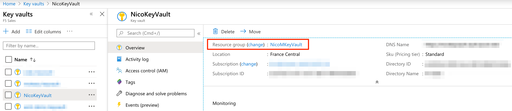

F5 BIG-IP Single NIC deployment
===============================

This folder contain a Terraform template to deploy the following:

* 1 F5 BIG-IP Standalone deployed with Single NIC
* 2 Ubuntu instances deployed with NGINX as web servers

Azure Keyvault
--------------

We don't want to include sensitive date into our template. We will store our data into *Azure KeyVault*:

* F5 username password once the platform will be provisioned

You need to create an Azure Keyvault and store this information into 3 different *secrets*:

* bigip-admin-user-password

HowTo
-----

Make sure that your Azure credentials are set on your system (env variables): <https://docs.microsoft.com/en-us/azure/virtual-machines/linux/terraform-install-configure>

To be able to use this terraform template, you'll need to create the relevant *terraform.tfvars* file. You can use *terraform-example.tfvars* as your starting point (rename/copy it into *terraform.tfvars*)

Here is how to populate *terraform.tfvars*:

terraform.tfvars:

* owner : Name of the owner of this template. Used to name objects
* project_name : Name of the project. Used to name objects
* azure_region : Azure region to use to create the relevant objects
* azure_secret_rg : Name of the ressource group containing your keyvault / secret
* azure_keyvault_name : Name of the keyvault

your KeyVault **MUST** contain a secret called: *bigip-admin-user-password*. This is the secret that Terraform will retrieve to use as the F5 username password

* azure_az1 : Azure AZ 1 to use
* azure_az2 : Azure AZ 2 to use. We will use 2 to spread our nginx instances
* key_path : Key path of your ssh public key. Something like "~/.ssh/id_rsa.pub"
* AllowedIPs : Public IPs allowed to access the environment
* f5_version : F5 version to use
* f5_image_name : name of the F5 image to use
* f5_product_name : F5 product name
* app_tag_value : Value assigned to the tag key Application

Deployment
----------

* do *terraform init* / *terraform get* / *terraform plan* / *terraform apply* to deploy your infrastructure
* *terraform output* will give you the relevant public IPs related to your infrastructure.
