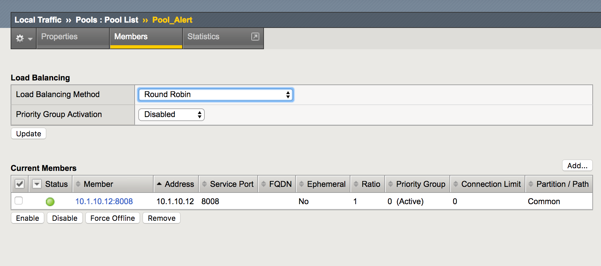

Create Alert Pool for BIG-IQ
============================

First of all, you need to create an Alert Pool in order to forward alerts from the BIG-IP (phishing and encryption) to the BIG-IQ DCD. When a Phishing is detected, for instance, the BIG-IP will send an alert to the DCD.

To do so, just create an new LTM Pool with a new member by using the DCD SELF-IP address and the port 8008.

