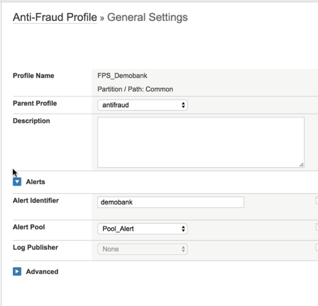
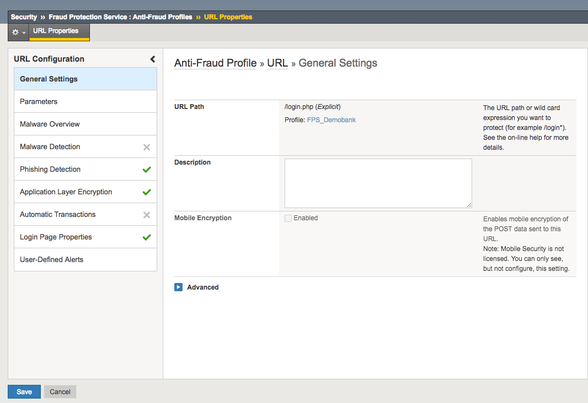
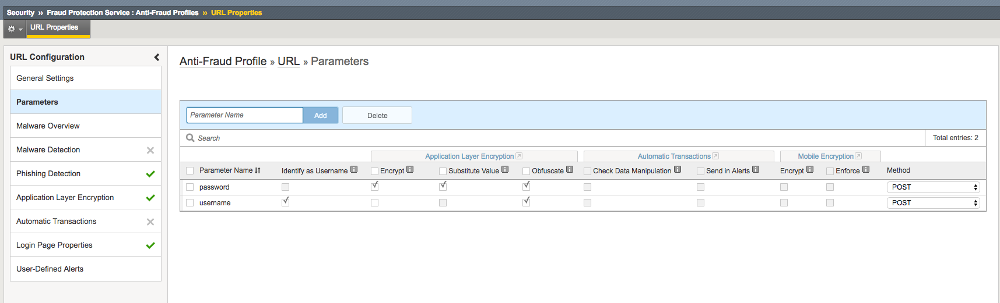
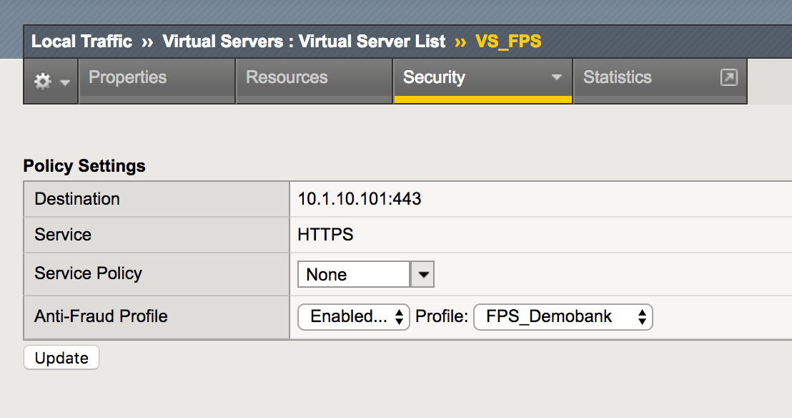

Create FPS Profile
==================

1.	Create an FPS profile in Security > Fraud Protection Service.

2.	Add an Alert Identifier and select the Alert Pool created in the previous steps

3. Add an URL for the login page to protect. In our demonstration, /login.php.

.. warning:: Use lowercase only even if the page file has uppercase

.. image:: ../images/Config_BIGIP_URL.png
	:align: center

And enable Phishing, Application Layer Encryption and Login Page Properties.

In the Login page properties, choose 302 HTTP response if the login page return a 302.

.. warning:: There is a known bug on V13.0. 302 redirection is not detected, so you have to select another method to detect Access Validation. You can use, for instance, the string "Welcome" to detect Access Validation to the webtop.

Then, add the 2 login page parameters, and check obfuscation and encryption boxes.

.. warning:: Don't forget to assign your new FPS profile on the Virtual Server in the security tab.

.. note:: Now, your BIGIP is ready and you must configure the BIGIQ in order to receive Phishing alerts
