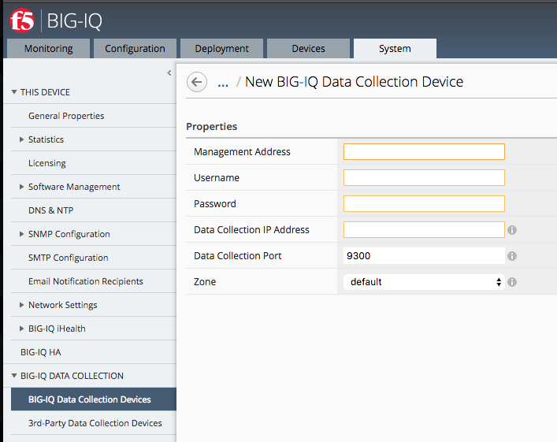
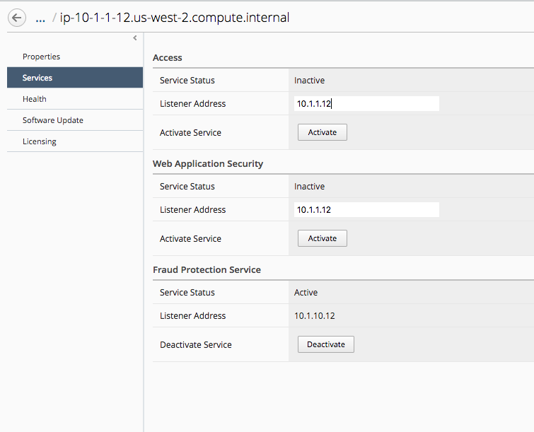

Configure BIG-IQ CM
===================

BIGIQ CM role is to render BIGIQ DCD alerts per module :

1. Phishing alerts
2. Encryption alerts

To do so, license the BIGIQ with a Centralized Manager license and configure the network part (VLAN, Self IP).

Then, add the BIGIQ DCD as a Data Collection device

1. Enter the Management IP address
2. Username / Password
3. Data Collection IP Address --> this is the BIGIQ SELFIP address

Next step is to specify the services the BIGIQ CM will use. In our case, only Fraud Protection Service.

.. note:: For the listener address, enter the SELF IP address on BIGIQ side and not the management address.

Then click activate it

.. note:: Your environment is Ready to Use, enjoy.
