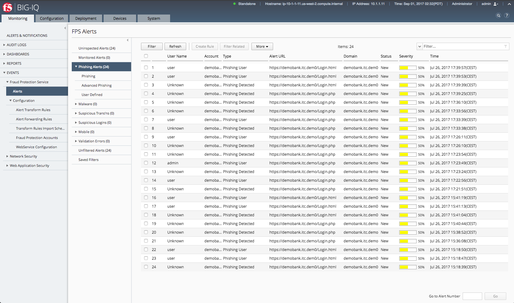

Check Anti-Phishing
===================

Simulate a phishing by downloading the login page and uploading it on a 3rd server.

When done, load the page and check:

1. The browser console to see if an alert is sent
2. The BIGIQ-CM alerts to check of the Phishing is detected

Next step is to login with a account on the phished server and check the alerts on the BIGIQ-CM.
You should see a Phishing User with the username.

Click on the screenshot below to zoom in.

