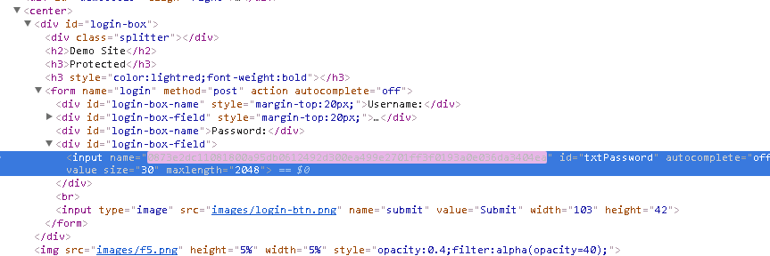
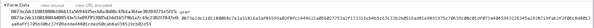

Check credential encryption
===========================

Connect with your favorite browser to the front end server and check if Websafe sends JS, obfuscates and encrypts the fields.

1.	Fields obfuscated

2.	Field values encrypted. Click to zoom, you can see the parameter is obfuscated and the password value is encrypted (second parameter)

